# YT Dubber

[](https://github.com/Ashut90/youtube-dubber/actions/workflows/ci.yml)
[](LICENSE)
[](CONTRIBUTING.md)
[](../../discussions)
[](../../releases/latest)

> **Want to try it or contribute? [Fork this repo](../../fork) — do not clone directly.**
>
> 🔒 **This project is GPL-3.0 licensed.** You must credit the original author and
> keep your modifications open source. Forking for private/commercial use without
> releasing your source code is not permitted. See [LICENSE](LICENSE).

Desktop app that **dubs YouTube videos into Hindi (and 19 other languages)** with a casual, engaging voice — like an Indian tech YouTuber, not a flat textbook narrator.

Paste a YouTube URL, and the app plays the video while generating and playing a synced dub on top. It pulls the video's captions, translates them to natural spoken Hinglish, synthesizes neural speech, and plays everything in sync — with a live transcript and on-screen subtitles.

A second **Live Dub** mode dubs *any* system audio in real time (browser, media player, calls) by capturing the audio device directly.

---

## What it looks like



The **video plays in a separate mpv window** (full quality). The Electron window is the control panel — subtitles, progress, and volume sliders. Both stay in sync via mpv's IPC socket.

---

## How It Works



---

## Two modes at a glance

| | **Video URL** | **Live Dub** |
|---|---|---|
| **Works on** | Linux, macOS, Windows | Linux only |
| **Source** | YouTube captions (any language) | Live mic / system audio |
| **Lag** | ~15s first run, instant on re-run | Always ~3–5s |
| **Cache** | ✅ Saves MP3 + JSON per segment | ❌ Real-time only |
| **Best for** | YouTube courses, tutorials | Streams, calls, any video |

---

## Source & Target Languages

- **Source:** Any language — the app auto-detects via the video's declared language
  and fetches its native captions. Pass `--source-lang <code>` (e.g. `ar`, `zh`, `en`) to force one.
- **Target:** 20 languages. **Hindi** gets the full casual-creator Hinglish prompt.
  All other 19 get an energetic, conversational prompt in their own language.

---

## Why mpv instead of a built-in video player

Electron's `<video>` element and Web Audio API crash with a **SIGSEGV** on Linux
machines with Optimus (Intel + NVIDIA) graphics — the GPU driver kills Chromium's
software renderer the moment it tries to decode video or create an `AudioContext`.

The fix: hand all media off to **mpv** (a native video player) and control it via
its JSON IPC socket. The Electron window becomes a pure HTML/CSS control panel
that never touches the GPU — it just shows subtitles, sliders, and status.

---

## Requirements

- **OS** — Linux (primary). **Video URL** mode also runs on macOS and **Windows**
  (the mpv IPC uses a named pipe on Windows, a socket elsewhere). **Live Dub** is
  **Linux-only** (it shells out to PulseAudio `parec`/`pacat`).
- **mpv** — `sudo apt install mpv` (macOS `brew install mpv`; Windows: add `mpv.exe` to PATH)
- **yt-dlp** — `pip install -U yt-dlp` (or distro package)
- **ffmpeg** — `sudo apt install ffmpeg`
- **Node.js 18+** and npm (for the Electron frontend)
- **Python 3.10+**
- A free **[Groq API key](https://console.groq.com/keys)**
- For **Live Dub** only: `pulseaudio-utils` (`parec`/`pacat`)

---

## Setup

### 0. Fork & clone

```bash
# 1. Click "Fork" on GitHub first, then:
git clone https://github.com/<YOUR_USERNAME>/youtube-dubber.git
cd youtube-dubber
git remote add upstream https://github.com/Ashut90/youtube-dubber.git
```

> Cloning the original repo directly means you can't contribute back. Fork first.

### 1. Backend (Python)

```bash
cd backend
pip3 install --break-system-packages -r requirements.txt
pip install -U yt-dlp        # must also be on PATH
```

> **Video URL** mode only needs `edge-tts` + `groq` + `yt-dlp`. The extra `numpy`/`silero-vad` deps are for **Live Dub** mode.

### 2. Frontend (Electron)

```bash
cd frontend
npm install
```

### 3. Groq API key

```bash
export GROQ_API_KEY=gsk_xxxxxxxxxxxxxxxxxxxx
```

Get a free key at [console.groq.com/keys](https://console.groq.com/keys). Export it in the same shell you launch the app from, so the spawned Python process inherits it.

---

## Running — Video URL mode (main feature)

```bash
cd frontend
export GROQ_API_KEY=gsk_xxxx
npm start
```

1. Paste a YouTube URL and pick a language + voice.
2. Click **Dub It**. An mpv window opens with the video (it starts **paused** while the first few seconds of dub are generated, then plays automatically).
3. Watch the video in the mpv window; the dubbed audio + subtitles play through the app.

**First run on a new video** rebuilds the cache and is gated by Groq's rate limit (~5s between batches), so a long video takes a while to fully process — but playback begins as soon as the opening buffer is ready, and the buffer-sync keeps audio aligned. **Subsequent runs on the same video are near-instant** thanks to the disk cache.

> Tip: don't seek far ahead during the first pass — the dub is generated sequentially from `0:00`. After a full run, the cache covers the whole video and seeking anywhere works instantly. (The app also strips any `&t=` start-time from the URL and forces the video to start at `0:00` to stay aligned with generation.)

---

## Running — Live Dub mode (any system audio)

This dubs whatever is playing on your machine in real time.

### 1. Create a virtual audio sink

```bash
pactl load-module module-null-sink sink_name=DubCapture \
  sink_properties=device.description=DubCapture
```

### 2. Route the source audio to it

Open **pavucontrol** → **Playback** tab → set the browser/player output to **DubCapture**.

### 3. Start it

Use the **Live Dub** tab in the app, or run the backend directly:

```bash
cd backend
export GROQ_API_KEY=gsk_xxxx
python3 live_dub_v6.py --lang hindi --gender male
```

The 5-agent pipeline (capture → Groq Whisper STT → Groq translate → edge-tts → playback) prints the live transcript and plays the dub through your speakers within a few seconds of each phrase. `Ctrl+C` to stop.

> **Lag floor ~3–5s** is inherent to live mode: a full phrase must be heard before it can be transcribed and translated.

---

## Use as a Python library

The dubbing engine ships as an installable package — use it in your own code,
scripts, or server with no GUI.

```bash
pip install youtube-dubber      # plus: yt-dlp + ffmpeg on PATH, and a Groq key
export GROQ_API_KEY=gsk_xxxx
```

```python
from youtube_dubber import dub

# One call → dubbed MP3 clips + a manifest.json in ./out
manifest = dub(
    "https://www.youtube.com/watch?v=VIDEO_ID",
    lang="hindi",      # any of the 20 supported languages
    gender="female",   # "male" or "female"
    out="./out",
)
print(len(manifest["segments"]), "segments dubbed")
```

Want live progress? Pass an `on_event` callback:

```python
from youtube_dubber import Dubber

def on_event(ev):
    if ev["type"] == "progress":
        print(ev["step"], ev["pct"], ev["msg"])
    elif ev["type"] == "segment":
        print("dubbed:", ev["dubbed"])

Dubber(lang="hindi", gender="male", out_dir="./out", on_event=on_event).run(url)
```

Or from the command line:

```bash
youtube-dubber --url https://youtu.be/VIDEO_ID --lang hindi --gender female --out ./out
```

> Output: `out/audio/<videoId>_<lang>_<gender>/seg_NNNNN.mp3` clips + `out/manifest.json`.
> The Electron desktop app is just one consumer of this same engine.

---

## Supported languages

Hindi, Tamil, Telugu, Bengali, Marathi, Gujarati, Kannada, Malayalam, Punjabi, Urdu, Spanish, French, German, Japanese, Chinese, Korean, Arabic, Portuguese, Russian, Italian.

Each has a configured male/female edge-tts neural voice. Indian languages use a **Hinglish/code-switch** style (technical terms stay English); others translate fully. See `backend/youtube_dubber/languages.py`.

---

## Project layout

```
youtube-dubber/
├── pyproject.toml             pip package config (youtube-dubber)
├── setup.sh / setup.bat       one-command dependency installers
│
├── frontend/                  Electron desktop app
│   ├── main.js                main process: mpv control, dub queue, spawns Python
│   ├── preload.js             contextBridge IPC API
│   ├── package.json           electron + build config
│   └── renderer/
│       ├── index.html         control-panel UI
│       ├── app.js             buffer/sync logic, subtitle + playback scheduling
│       └── styles.css
│
└── backend/
    ├── youtube_dubber/        ★ the installable dubbing-engine package
    │   ├── __init__.py        public API: Dubber, dub, LANGUAGES
    │   ├── core.py            the engine (captions → translate → TTS → cache)
    │   ├── cli.py             `youtube-dubber` command + `python -m youtube_dubber`
    │   └── languages.py       20-language registry (voices, script, style)
    ├── dub_video.py           thin Electron adapter → calls the package
    ├── live_dub_v6.py         Live mode: 5-agent real-time pipeline
    ├── natural_tts.py         edge-tts wrapper used by Live Dub
    ├── vad.py                 Silero voice-activity detection (Live Dub)
    ├── languages.py           compatibility shim → youtube_dubber.languages
    └── requirements.txt
```

---

## Configuration

**Translation / TTS** — `backend/youtube_dubber/core.py`:

| Knob | Where | Effect |
|---|---|---|
| `BATCH_SIZE` | top of file | Segments per Groq call (fewer API round-trips vs. faster first audio) |
| model | `client.chat.completions.create(...)` | `llama-3.1-8b-instant` (reliable) vs. `llama-3.3-70b-versatile` (more casual, stricter rate limit) |
| `stretch()` cap | `stretch()` | Max speed-up to fit a clip to its window (default `1.4×`) |
| slang map | `_SLANG` dict | Formal → casual phrase replacements |
| TTS rate/pitch | `_synth_one()` | edge-tts `rate`/`pitch` per language |

**Playback sync** — `frontend/renderer/app.js`:

| Knob | Effect |
|---|---|
| `START_BUFFER` | Seconds of dub ready before first play (default 6) |
| `PAUSE_GAP` / `RESUME_GAP` | When to pause/resume mpv as it approaches the generation frontier |
| `STALE_DROP` (in `main.js`) | Drop a dub clip if its segment ended this far behind the playhead |

**Voices** — `backend/languages.py` (`voice_male` / `voice_female` per language).

---

## Known limitations & trade-offs

- **mpv plays in its own window**, not embedded in the app — a deliberate workaround for the Chromium SIGSEGV on Optimus systems.
- **8b translations are sometimes verbose**, so an occasional long sentence finishes slightly late or gets dropped to stay in sync (never cut mid-word). The cure is shorter translations / a stronger prompt.
- **Hindi is the best-tuned target.** The other 19 languages get a casual prompt too, but quality depends on the 8b model's fluency in that language.
- **Non-English source** relies on the video having captions in its own language (or being detectable by Whisper). Auto-detection via the declared language is reliable but not infallible — use `--source-lang` to force it.
- **Live Dub is Linux-only** (PulseAudio); the Video URL mode is the cross-platform one.
- **Groq free-tier rate limits** make the *first* pass on a long video slow; the cache makes re-runs fast.
- **edge-tts needs internet** (it calls Microsoft's servers).
- **Live Dub lag floor ~3–5s** is inherent to listen-then-translate.
- **Mixed Devanagari + Latin** script can occasionally trip TTS intonation.

---

## Troubleshooting

| Symptom | Likely cause / fix |
|---|---|
| No dub audio at all | Groq key not exported in the launch shell; wait ~20–30s for first batch to clear the rate limit. |
| Female voice sounds like first run is slow | It is — female cache is separate from male. First female run generates everything fresh; re-runs are instant. |
| Dub plays but goes silent after a while | Video ran ahead of generation. Don't seek ahead on first pass; let the buffer-sync handle pacing. |
| Live Dub plays nothing | Make sure you routed your app's audio to **DubCapture** in pavucontrol first. |
| Live Dub crashes immediately on macOS/Windows | Live Dub is Linux-only (PulseAudio). Use Video URL mode on other OS. |
| mpv window doesn't open | `mpv` not installed — `sudo apt install mpv`. |
| Dub reads out URLs or bash commands | Cleared by `clean_text()`; if it persists, delete the cache and re-run. |
| Want fresh translations for a video | `rm -rf ~/.config/yt-dubber/dubout/audio/<videoId>_<lang>_<gender>/` |
| Want to force a specific source language | Add `--source-lang ar` (or `zh`, `en`, etc.) to the Python CLI or wait for UI support. |

Cache location: `~/.config/yt-dubber/dubout/audio/`.

---

## Contributing & Discussions

Found a bug? Have an idea? Want to add a language or improve the dubbing quality?

**Don't just fork silently — come talk:**

- 💬 **[Start a Discussion](../../discussions)** — ideas, questions, show your fork
- 🐛 **[Open an Issue](../../issues)** — bug reports
- 🔀 **[Submit a PR](../../pulls)** — code contributions (read [CONTRIBUTING.md](CONTRIBUTING.md) first)

If you've built something on top of this project, share it in Discussions — I want to see what people are creating.

---

## Credits & Attribution

**Original project:** YT Dubber  
**Author:** [Ashutosh (@Ashut90)](https://github.com/Ashut90)  
**License:** GPL-3.0 — see [LICENSE](LICENSE)

If you fork this project, you **must**:
1. Keep this credits section or link back to this repo
2. State clearly what you changed
3. License your fork under GPL-3.0

Built with: [Groq API](https://groq.com) · [edge-tts](https://github.com/rany2/edge-tts) · [mpv](https://mpv.io) · [yt-dlp](https://github.com/yt-dlp/yt-dlp) · [Electron](https://www.electronjs.org)
